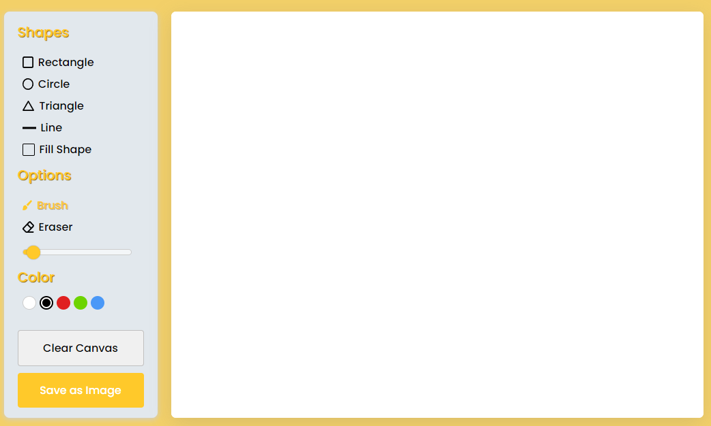

# Weather APP

## Welcome! 👋

This is a web application for desktop and Table, with the purpose of being an app for drawings, you will can draw, paint, make shapes, erase, while being able to download your drawing.

## Links
* Live Site URL: [Paint APP](https://euphonious-praline-fe7293.netlify.app/)

## My Process.

### Things i have learned.
I learned how to use Canvas and many of it's functions, like lineTo, moveTo or stroke.

### Built with
* Semantic HTML5 markup
* Css custom properties
* FLEXBOX
* SCSS
* JavaScript
* BEM Methodology
